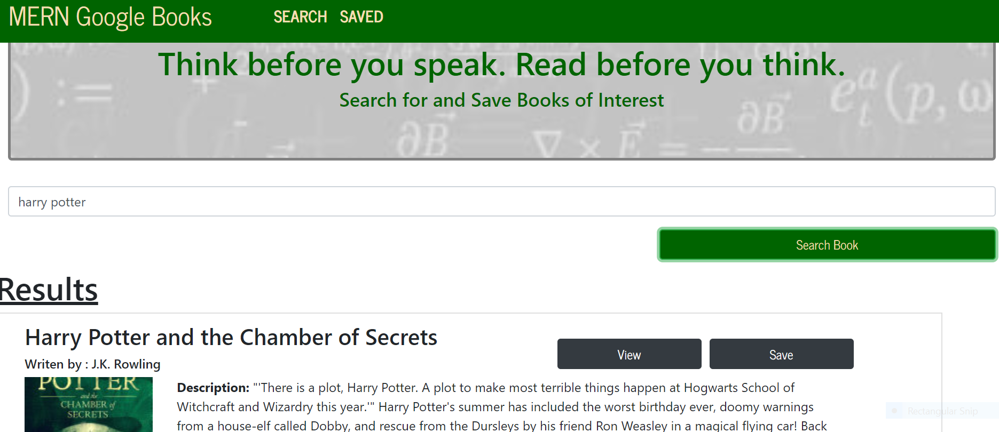
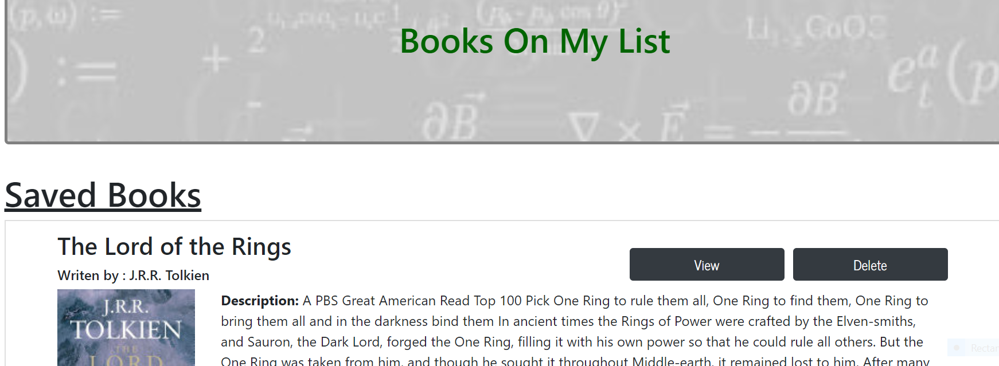
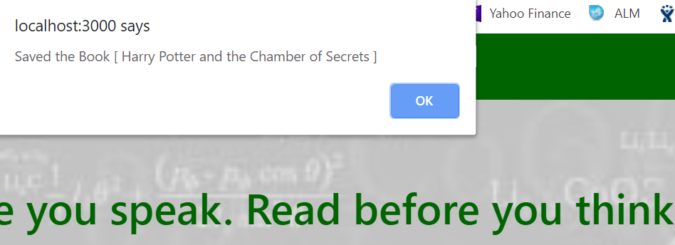

# mern-google-books-search
 MERN – MongoDB, Express, React, Node

 This project was bootstrapped with [Create React App](https://github.com/facebook/create-react-app).

## heroku live URL
https://yzhou-mern-booksearch-live1.herokuapp.com/

## git repo
https://github.com/yzhouyzhou/mern-google-books-search

## updated ying zhou's updated portfolio
MERN Google Book Search September 15 2019
https://yzhou-mern-booksearch-live1.herokuapp.com/

## Overview
This assignment creates a google book search with React. The user is able to search interested Books by title from Google Book API;
list the search result; view or save the book; saved book stored the book information into MongoDB for future review. 

*   Nav
*   Jumbotron
*   Form
*   Grid and Btn
*   Thumbnail
*   Footer

## Search page is used Google Book API

## Saved page is stored the book information into MongoDB

## Save button to save the book

## After books saved you can delete the books

## Technologies used

<ul><li>MERN: MongoDB Express React Node</li><li>Bootstrap</li><li>JavaScript</li><li>ES6</li></ul>

## Available Scripts

